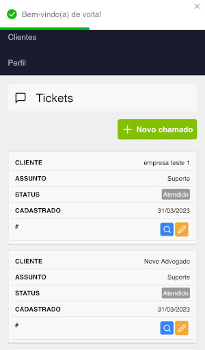
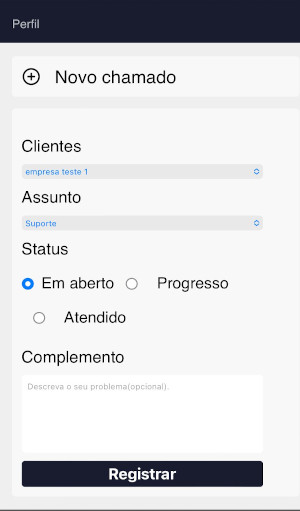
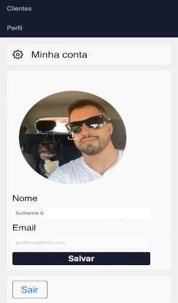
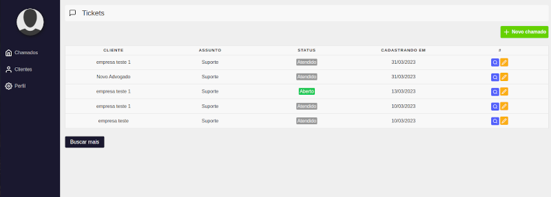
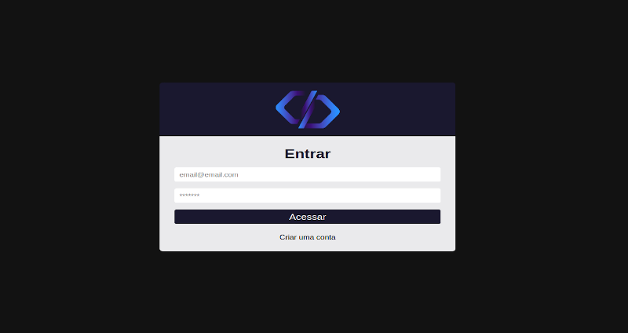

# New-System 
This project was bootstrapped with [Create React App](https://github.com/facebook/create-react-app).
In the project directory, you can run:
### `npm start`
Runs the app in the development mode.\
Open [http://localhost:3000](http://localhost:3000) to view it in your browser.

# Sobre o projeto
 Desenvolvimento de uma aplicação com sistema de login completo, utilizando Firebase para proteger as informações dos usuários. A aplicação permite a adição de clientes e abertura de chamados para diferentes tipos de atendimentos, com itens editáveis e responsivos para melhor experiência do usuário.

## Layout mobile
  

## Layout web

# Tecnologias utilizadas

## Front end
- HTML 
- SCSS 
- JS 
- Next-JS

# Autor

Guilherme Gomes

https://www.linkedin.com/in/guilherme-gomes-427321238/
